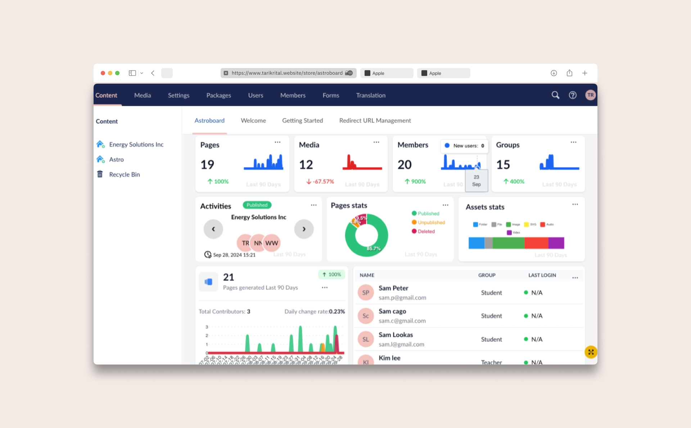

Astroboard is an Umbraco dashboard to get insights of your contents, assets and members.

## About This Repository

The purpose of this repository is to act as a central hub for reporting issues with Astroboard. This repo will **NOT** contain the Astroboard source code which is closed source.

## Preview - Compact mode

## Preview - Full screen mode

## System Requirements
Astroboard has the following requirements:
Umbraco version 10, 11, 12, 13 and 14 (in progress).

>It is recommended to upgrade your Umbraco installation to the latest version.

## Installation

`dotnet add package astroboard`

## Just like that, it’s done! 🎉
If you've installed the Astroboard you should start your website (`dotnet run`) and automatically the Astroboard section should appear in the backoffice, as shown in previews above.

## Copyright

Copyright © 2024 [Tarik Rital](https://www.tarikrital.website/store/).