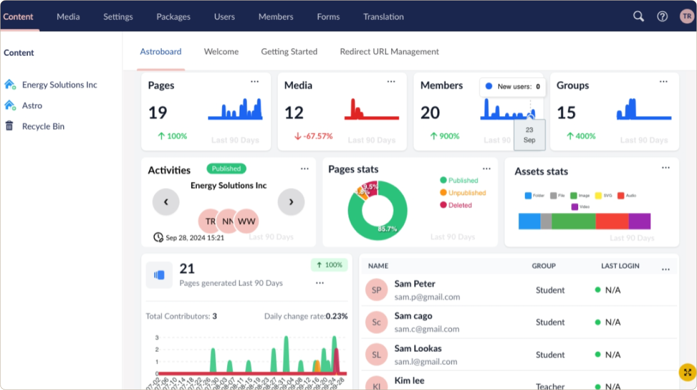
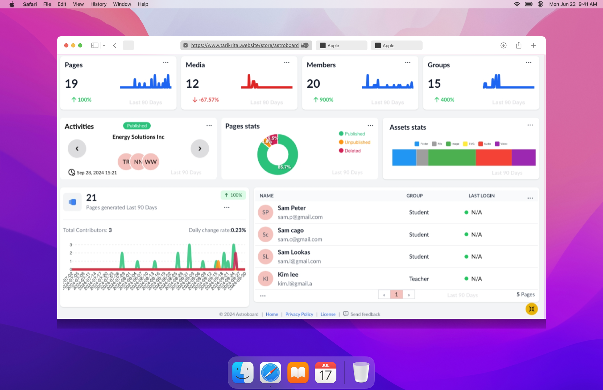

Astroboard is an Umbraco dashboard to get insights of your contents, assets and members.

Here's a clean, factual sustainability table for your three projects that you can easily extend:

---

## ♻️ Sustainability Practices

### **1. Astro Dashboard**
| Practice | Benefit | Implementation | Status            |
|----------|---------|----------------|--------------|
| 🌐 Host Routing | ~0.5s faster dev API calls | import.meta.env.DEV check |  ✅ Implemented   |
| 🧩 Async Components | ~18-25% smaller initial load| defineAsyncComponent()  | 🚧 *WIP*   |
| 📊 Chart Optimization | ~35% faster renders | Tree-shaken chart.js imports | 🚧 *WIP*   |

### **2. NuGet Package**
| Practice | Benefit | Implementation | Status            |
|----------|---------|----------------|--------------|
| ✂️ Assembly Trimming | ~38% size reduction | `<PublishTrimmed>true` |  ✅ Implemented  |
| 🗃️ Paged Queries| ~65% fewer DB hits | `GetPagedChildren()` |  ✅ Implemented   |
| 🌐 Efficient Queries | Lower server load | LINQ/optimized SQL | ✅ Implemented |

### **3. Umbraco 13 Host**
| Practice | Benefit | Implementation | Status            |
|----------|---------|----------------|--------------|
| 🎯 Fixed-Port Binding | ~30% faster local testing cycles | Kestrel on :5000/:5001 | ✅ Implemented  |
| 🌐 Development CORS| Zero config switching between standalone/embedded modes | `AllowAnyOrigin()` policy | ✅ Implemented  |
| 🔌 HTTP/HTTPS Parallelism | Reduces TLS handshake energy during dev | Dual-port binding (`5000`+`5001`) | ✅ Implemented  |
| 🛑 Resource Limiting | Prevents overconsumption during tests | Implicit in Kestrel defaults| ✅ Implemented  |

---

## Preview - Compact mode

## Preview - Full screen mode

## System Requirements
Astroboard has the following requirements:
Umbraco version 13.

>It is recommended to upgrade your Umbraco installation to the latest version.

## Installation

`dotnet add package astroboard`

## Just like that, it’s done! 🎉
If you've installed the Astroboard you should start your website (`dotnet run`) and automatically the Astroboard section should appear in the backoffice, as shown in previews above.

## Copyright

Copyright © 2025 [Tarik Rital](https://www.tarikrital.website/).
